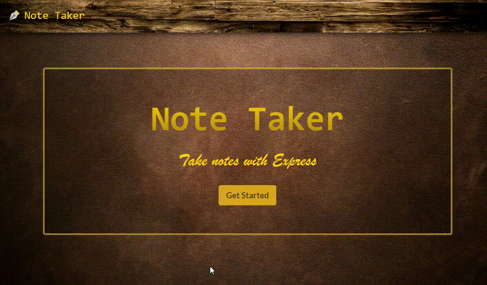
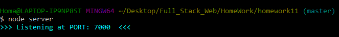

# Note Taker      
### Homework - 11

 node server.js

 


## 📌Table of Content

* [Description](#description)
* [Installation](#installation)
* [Usage](#usage)
* [Test](#test)
* [Contributing](#contributing)
* [License](#license)
* [Details](#details)
* [Features](#features)
* [URL](#url)
* [Questions](#questions)

## 📋Description
"Note Taker" is a server side application that can be used to write, save, and delete notes. This application will use an express backend and save and retrieve note data from a JSON file.
```
AS A user, I want to be able to write and save notes
I WANT to be able to delete notes I've written before
SO THAT I can organize my thoughts and keep track of tasks I need to complete

```
- Open the server using "command line", (recomended: GitBash).



- Output index.html


## 💿Installation
  ### Prerequisites
    1. Install node.js  
    2. Clone the repository
    3. npm install

## ▶️Usage
Open the server using "node server" in your terminal. Then after hitting the start button, you will be able to write, save and delete notes. 


## 📊Test
 ```
 npm run test (None).
 ```


## 🤝Contributing
Feel free to pull request and give me your suggestions if any.
          
## ⚖️License  
This project is under the MIT License.

## 📑Details

This repository content the files: JavaScript "server.js", Mit license"LICENSE.txt", "package.json", "package-lock.json",db Folder (data base json), public folder, "node_modules" folder and an "image" folder with the captures and gifs for this Readme File.

## 📀Features
- Fully responsive
  

 ## 🔗URL  

- The URL to open the repo page on your Browser is "https://diegolehyt.github.io/homework11/"
- Check my Demos on Youtube "https://www.youtube.com/channel/UCev6xJU1FGx1IbRjQhtjKcQ"

## 👤Questions  
   


✉️ E-mail: diegolehy00@gmail.com